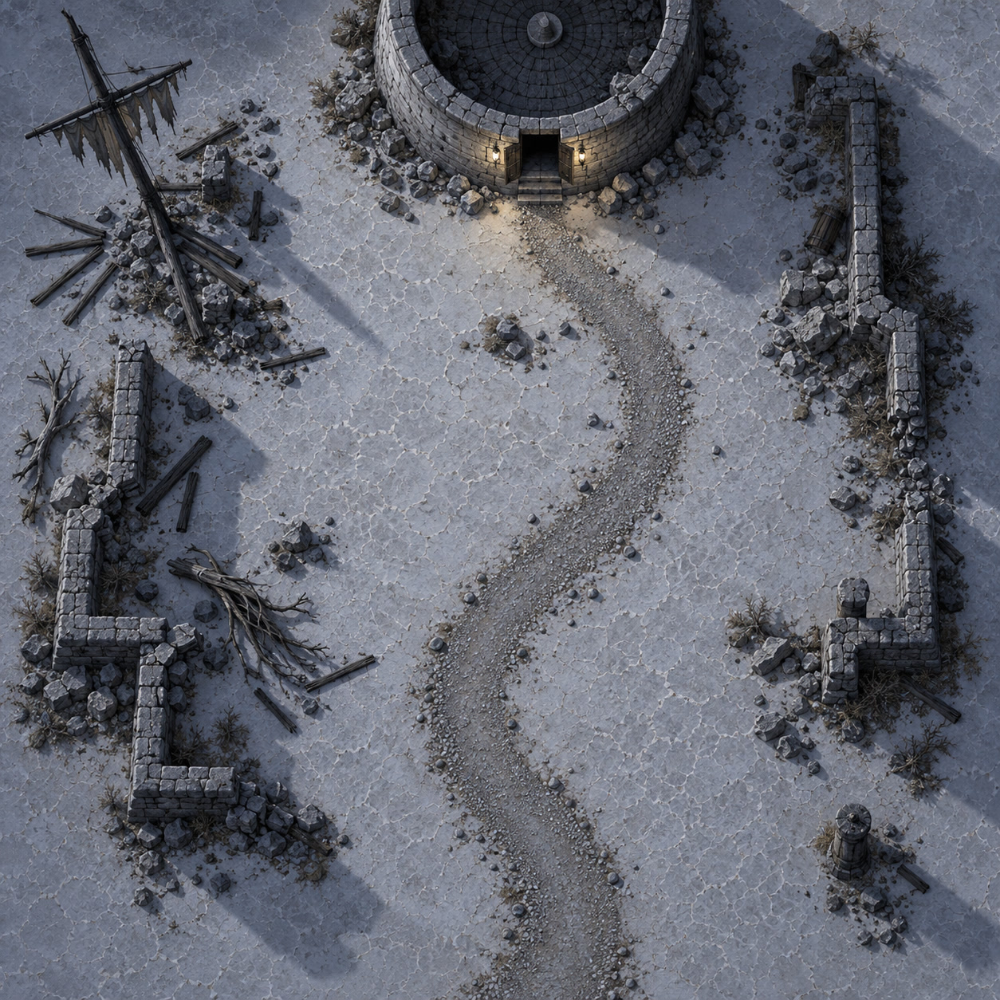
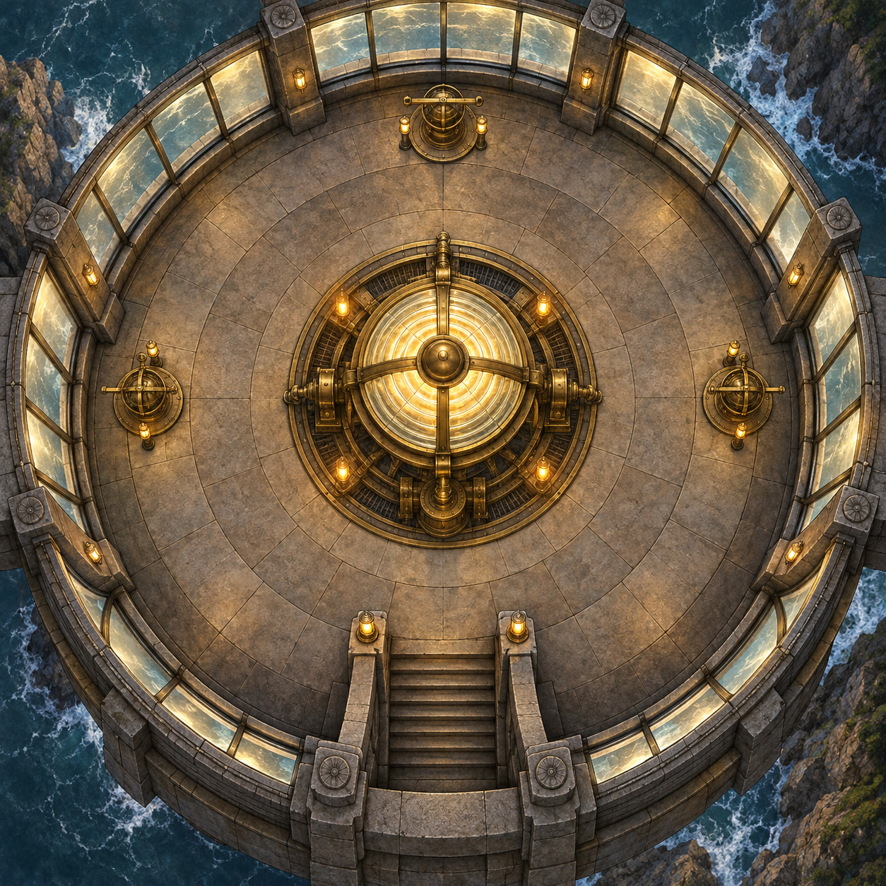

# Combat Tracker — The Lighthouse on Dry Land

**Two encounters — an optional keeper confrontation and a finale the party may resolve, negotiate, or leave.** Encounter 1 is **optional and non-lethal by default**: the enthralled watchkeeper can be calmed with a document, a phrase, or ***remove curse***, or simply walked past. Encounter 2 is the session's objective — a ritual on a six-segment clock, four bound captives, a cult operator, and a lesser demon.

**Party: five PCs at Level 6.** 2014 DMG per-PC thresholds — **Easy 300 · Medium 600 · Hard 900 · Deadly 1,400** — so at **5 PCs**: **Easy 1,500 · Medium 3,000 · Hard 4,500 · Deadly 7,000.** Every stat block is **⚗️ homebrew with a provisional budget CR**: the CR is a budget rating chosen to size the fight, **not a verified DMG-derived defensive/offensive calculation.** Treat every difficulty band as **provisional.** **No PC is ever written into a card or a handout** — Juniper's character's name goes in the blank initiative rows and nowhere else.

> [!WARNING]
> **Tactical maps are generated.** The written distances and terrain rules below remain authoritative if the artwork differs. Both maps are stored locally; exact prompts are in `images/images.json`.

---

## Encounter 1 — Keeper Tamsin Reed and the Turning Light

*Act II, Scene 2.1 · Optional, non-lethal by default · Easy-to-Medium *(provisional)* (1,800 XP / Easy 1,500 – Medium 3,000 at 5×L6)*

### Summary

| | |
|---|---|
| **Location** | The Drywater, at the foot of the **Sarshel Light** — the fossil tideline and the tower's south door, on the road's bend. |
| **Light** | The lamp turning overhead; the snare's fixed moon; salt-fog to 120 ft. The lamp is a light source the DM can dim (*Guttering*, below). |
| **Terrain** | Cracked silt flat; a chest-high **fossil tideline** (half cover, Climb 10 ft, 15-ft gap at the east end); two **beached wrecks** (full and half cover); three **anchor posts** (half cover); the tower's **40-ft stone drum** with one south door. |
| **Antagonists** | 1× **Keeper Tamsin Reed** (CR 5 provisional, ⚗️) + the **Turning Light** (lair actions) |
| **Party** | **5 PCs at L6** — Nalith, Naan, Kto, Yinu, and **Juniper's character** (name/build open). |
| **XP** | 1,800 × 1.0 (single creature) = **1,800 → Easy-to-Medium *(provisional)***. A 2–3 round fight that can be avoided entirely. |
| **Duration** | 3 rounds or fewer. She **yields the moment any calm-down route lands** — the DM should be looking for the exit, not the grind. |
| **Goal (PCs)** | Get up the stair — or get Tamsin back. |
| **Goal (Tamsin)** | Keep them off her stair and away from her lamp. **She thinks they are wreckers** — the old coastal crime — and she is defending a *person*, not a building. |
| **Non-lethal by default** | She fights to subdue: **she never strikes an unconscious creature**, and any hit of hers that would drop a PC can be narrated as the flat of the hook. |
| **Skip condition** | Five ways past her with no fight — the log extract, the watch-words, *remove curse*, *dispel magic* DC 15, or **walking around her.** **Her pursuit is bounded and stated, not magical:** the charm binds her to the tower base and she will not cross the fossil tideline. The entrance is unbarred: use normal movement and any applicable opportunity attack to pass her apron; she does not pursue upstairs. |

### Round Strip & Initiative

**Round:** ☐ 1 · ☐ 2 · ☐ 3 · ☐ 4 · ☐ 5 · ☐ 6 · ☐ 7 · ☐ 8 · ☐ 9 · ☐ 10

NPC initiative is pre-rolled (`round(avg(1d20 + DEX))`). PCs roll live and write into the blank rows.

| Init | Combatant | AC | HP | Notes |
|---|---|---|---|---|
| __ | _________________ | __ | _________________ | _________________ |
| __ | _________________ | __ | _________________ | _________________ |
| __ | _________________ | __ | _________________ | _________________ |
| 12 | Keeper Tamsin Reed | 16 | 85: ☐☐☐☐☐ ☐☐☐☐☐ ☐☐☐☐☐ ☐☐☐☐☐ ☐☐☐☐☐ ☐☐☐☐☐ ☐☐☐☐☐ ☐☐☐☐☐ ☐☐☐☐☐ ☐☐☐☐☐ ☐☐☐☐☐ ☐☐☐☐☐ ☐☐☐☐☐ ☐☐☐☐☐ ☐☐☐☐☐ ☐☐☐☐☐ ☐☐☐ | **Charmed by the light** (*remove curse* / *dispel magic* DC 15 ends it) · **Ward-Bound** to the tower's mile · **Bloodied 42** (she starts talking) · key, code, and logbook on her belt — **takeable if she is unconscious** |
| __ | _________________ | __ | _________________ | _________________ |
| __ | _________________ | __ | _________________ | _________________ |

**Conditions:** Bln · Chr · Deaf · Frt · Grp · Inc · Inv · Prl · Pet · Pzn · Prn · Rst · Stn · Uns · Conc

### Triggers & Countdowns

- **Calm her (the intended ending).** Any one of these ends the fight on the spot: **Orin's log extract read aloud** (free, no roll); the **watch-words** call-and-response (Orin has them on the flyleaf; free if the party asked him in Scene 1.2); ***remove curse*** (⚗️ homebrew ruling — the charm is the reversed ward's hold, and the table already used this call on Oberon's thrall in S6); ***dispel magic* DC 15**; **Persuasion or Insight DC 13** while showing her the captives' names or the ledger page. **Calmed, she hands over lantern-key and shutter-code** and comes up as a witness, not a fighter.
- **Bloodied (≤42 HP).** She stops swinging, backs to her door, and starts *listening* — every calm-down route lands automatically. Give the table the beat.
- **Non-lethal resolution (⚗️).** Any hit of hers that would reduce a PC to 0 HP leaves them at **1 HP and prone** instead. Knock *her* out with non-lethal damage and she is **unconscious, stable, alive** — key, code, and logbook on her belt.
- **Walk past her.** Once the party is inside, **she does not pursue upstairs** — she shouts the truth at their backs and holds the doorway. Her standing order keeps her on the exterior apron; she chooses to hold it rather than pursue upstairs.
- **Killed.** If Tamsin dies, **the light gutters and the alarm carries: Encounter 2 begins with the ritual clock at segment 1 already banked.** No other scaling — a setback, not a death sentence — and the **shutter route remains available** ; recover the key and code from her belt.
- **The Turning Light (lair actions, initiative 20).** While the lamp burns, one per round: **Lamp-Flash** — one creature in line of sight, **DEX DC 13** or **blinded until the end of its next turn**. **The Longing** — one creature, **WIS DC 13** or it sees its longing and has **disadvantage on its next attack roll**; on a success it gains the ***disbelieving*** tag (recognition that the visions are false; it does not itself dispel magic). **Guttering** — a 15-ft radius around Tamsin is **heavily obscured** until the next initiative 20.
- **Do not stall this scene.** If the dice are grinding, she goes bloodied and starts talking, or the lamp gutters and she loses a turn. The night's real clock lives upstairs.
- **What she knows (free, if calmed):** **Veyra Sorn came to her door as a ward-repairer** ⚗️ — a commission and a customs writ, "to service the old light-ward before the season turns." She let her in, opened the lamp for her, and has watched the cost for three months. She also knows she has **turned Orin Vale back off the tideline twice** — non-lethally — and hates that she did.

### Tactics Summary

- **Keeper Tamsin Reed** — R1: three warnings, then **Boat-Hook** at the lead PC (or **Lamp-Spark Flare** if two or more crowd her). R2: **Wrenching Drag** whoever is closest to the stair back into the open. R3+: yield to any calm-down route; otherwise hold the doorway and let the *Turning Light* work. **She never leaves the tower base and never pursues a downed PC.**
- **The Turning Light** — one lair action per round at initiative 20. Prefer *The Longing* early (it hands the table the snare's rules for free) and *Lamp-Flash* when a caster is lining up at the door.

### Loot / Aftermath

- **Tamsin’s kit:** key, written shutter-code, original logbook, ordinary patched coat, lantern, staff, and a mundane bent nail. Her cold resistance is a ward effect, not transferable armor.
- **Alive and calmed**, she is the session's best witness and comes up the stair with them. **Unconscious**, the key and code come off her belt. **Dead**, she is a name in the post-play log and the party's own alarm.
- **No coin.** She has served under the charm for three months and paid in nothing.

### Keeper Tamsin Reed

> Weathered keeper with windblown silver hair, patched blue-green coat, rope belt, brass lantern, and a gnarled staff. Her boat-hook and wrench hang beside the doorway and come out if she fights.

**Medium humanoid (human), Lawful Neutral (charmed), ⚗️ homebrew · CR 5 provisional budget rating (1,800 XP)** — *a budget rating set to size this fight against a 5×L6 party, not a DMG-derived CR calculation; run it loosely.*

| | |
|---|---|
| **AC** | 16 (keeper's oilskin and plate-scrap over leather) |
| **HP** | **85** (10d8 + 40) · **Bloodied 42** |
| **Speed** | 30 ft. |
| **STR / DEX / CON** | 16 (+3) · 12 (+1) · 18 (+4) |
| **INT / WIS / CHA** | 11 (+0) · 14 (+2) · 12 (+1) |
| **Saves** | STR +6, CON +7 |
| **Skills** | Athletics +6, Perception +5, Survival +5 |
| **Resistances** | Cold |
| **Condition Immunities** | None; the lighthouse charm is a specific homebrew effect, not general immunity to charm or fear |
| **Senses** | Passive Perception 15 |
| **Languages** | Common, Chondathan |

**Traits.** ***Charmed by the Light*** ⚗️ — the reversed ward's hold. Ends on ***remove curse*** (no roll), ***dispel magic* DC 15**, or any calm-down route. When it breaks she is herself: exhausted, appalled, useful. ***Ward-Bound*** ⚗️ — she cannot willingly move more than **200 ft from the tower base**, and she will not cross the **fossil tideline** (≈50 ft out from her door) at all; **her pursuit is bounded, visible, and never a magical vanish.** ***Keeper's Restraint*** ⚗️ — she fights to subdue: any hit of hers that would drop a creature to 0 HP leaves it at **1 HP and prone**, and she never strikes an unconscious creature.

**Actions.** ***Multiattack.*** Two **Boat-Hook** attacks, or one Boat-Hook and one **Wrenching Drag**. ***Boat-Hook.*** Melee, reach 10 ft., **+6**, **1d8 + 3 piercing** plus **1d6 lightning** (lamp-spark). ***Wrenching Drag.*** Melee, reach 10 ft., **+6**, 1d4 + 3 bludgeoning, and **STR DC 14** or the target is **pulled 10 ft.** toward her and **grappled** (escape DC 14). ***Lamp-Spark Flare (Recharge 5–6)*** ⚗️ — she throws her hand-lamp's aperture open: **20-ft cone**, **DEX DC 14**, **4d6 radiant**, half on a success, and a failure is also **blinded until the end of its next turn**.

**Bonus Actions.** ***Keeper's Shove.*** **STR DC 14** against a creature within 5 ft. — push 10 ft. and no reactions until the start of its next turn.

**Reactions.** ***Parry the Wrench.*** +3 AC against one melee attack that hits her. Once per round.

**On defeat (subdued).** Unconscious and stable, key and code on her belt. When she wakes — calmed or not — she wants to know what the party found upstairs, and she believes whatever the log says.

---

## Encounter 1 — Tactical Layout *(written dimensions remain authoritative)*

**Grid: 1 square = 5 ft. Field is 80 ft. × 80 ft. (road to door), north up.** PCs enter from the south edge.

- **The Salt Way (south edge).** 20 ft. wide across the field's south side; the road bends north at the tower.
- **The fossil tideline (mid-field, east–west).** Chest-high wall 30 ft. north of the road. **Half cover; Climb 10 ft. across; a 15-ft gap at the field's east end** where the road bends through — the intended approach.
- **Wreck A (west, north of the tideline).** 25 × 15 ft. hull on its side — **full cover, climbable**, ribs making a 10-ft pocket of dim light. **Wreck B (east, south of the tideline).** 20 × 10 ft., angled — half cover; blocks the road-to-door line.
- **Three anchor posts** (stone bollards, 4 ft.) at the field's centre, 15 ft. apart — half cover.
- **The tower base.** A **40-ft-diameter stone drum** at north-centre with a **south door**; a **40 × 15 ft. bare-rock apron** fronts it.
- **Tamsin starts 20 ft. south of the door**, on the apron, between the party and the stair. She retreats to the doorway at bloodied and never crosses the tideline.
- **Distances:** road → tideline **30 ft.**; tideline gap → door **50 ft.**; door → stair foot **10 ft.** (inside); road → door **80 ft.**
- **Light:** the turning lamp — bright on the apron, dim beyond 30 ft.; the fixed moon (dim) elsewhere. *Guttering* drops the apron to heavily obscured for a round.
- **Vertical:** tideline is a chest-high obstacle (climb costs normal extra movement); wrecks 15 ft and 10 ft; tower 90 ft high. The door is the obvious entry, but climbing, ropes, or available flight can reach the gallery.

---

## Encounter 2 — The Lantern Chamber

*Act II, Scene 2.2 · Hard *(provisional)* (6,150 adjusted XP / Hard 4,500 – Deadly 7,000 at 5×L6)*

### Summary

| | |
|---|---|
| **Location** | The lantern room at the top of the **Sarshel Light** — a 60-ft circular chamber under an open brass dome, five feet of gallery outside the glass. |
| **Light** | The lens is the only light: brilliant, white-yellow, full of nowhere to go. Bright light in the centre 20 ft., dim to the walls; the snare's fixed night above. |
| **Terrain** | **60-ft chamber; central 10-ft lens on a gimbal cradle; three fire-scribed pedestals (N, E, W; 5 ft. wide, half cover); four captive brackets inside the cradle ring; the stone stair rises from the south; a 5-ft gallery ring with a 3-ft parapet.** |
| **Antagonists** | 1× **Veyra Sorn** (CR 6 provisional, ⚗️) + 1× **Brine Fiend** (CR 5 provisional, ⚗️) + the ritual clock |
| **Objects** | **Sarshel Glass** (AC 15 / HP 30, threshold 10) · 3× **Fire-Scribed Pedestal** (AC 15 / HP 20) · 4× **Iron Bracket** (AC 12 / HP 10) |
| **Party** | **5 PCs at L6** — Nalith, Naan, Kto, Yinu, Juniper's character. |
| **XP** | 2,300 + 1,800 = 4,100 × **1.5** = **6,150 → Hard *(provisional)***, just under Deadly. |
| **Duration** | Six clock segments; typically 4–7 rounds of combat. |
| **Goal (PCs)** | Free the four captives, break the ritual, and **deal with the lens** — smash, restore, or shutter. |
| **Goal (Veyra)** | Finish the Drawing. She will spend the party's lives to do it, and she will bargain while she works. |
| **Goal (Brine Fiend)** | Get fully into the world and eat what is on the brackets. |
| **Arrival state** | More than one hour before dawn: third pedestal inactive for this encounter, emissary appears round 2 and is half-manifested that round. Final hour: all three lit, fiend present and half-manifested round 1. Surprise follows ordinary stealth rules. Alarm starts clock at 1 once when Veyra begins; no extra rest penalty. After completion at dawn: use breach aftermath instead of resetting clock |
| **Scaling down (lighter)** | Party arrives genuinely out of gas: the Brine Fiend starts at **45 HP** and skips *Drowning Grasp* on round 1. The clock rule never changes. |

### Round Strip & Initiative

**Round:** ☐ 1 · ☐ 2 · ☐ 3 · ☐ 4 · ☐ 5 · ☐ 6 · ☐ 7 · ☐ 8 · ☐ 9 · ☐ 10

**Ritual clock — the Drawing:** ☐ 1 · ☐ 2 · ☐ 3 · ☐ 4 · ☐ 5 · ☐ 6 *(one deterministic rule — see Triggers)*

| Init | Combatant | AC | HP | Notes |
|---|---|---|---|---|
| __ | _________________ | __ | _________________ | _________________ |
| __ | _________________ | __ | _________________ | _________________ |
| __ | _________________ | __ | _________________ | _________________ |
| 13 | Veyra Sorn | 16 | 90: ☐☐☐☐☐ ☐☐☐☐☐ ☐☐☐☐☐ ☐☐☐☐☐ ☐☐☐☐☐ ☐☐☐☐☐ ☐☐☐☐☐ ☐☐☐☐☐ ☐☐☐☐☐ ☐☐☐☐☐ ☐☐☐☐☐ ☐☐☐☐☐ ☐☐☐☐☐ ☐☐☐☐☐ ☐☐☐☐☐ ☐☐☐☐☐ ☐☐☐☐☐ ☐☐☐☐☐ | **Advances the Drawing +1 (once/round max)** · *Warded by the Ritual* while ≥1 pedestal burns · ***Counter-Ward*** reaction (once/round) · flees below 25 HP if the fiend is gone |
| 13 | Brine Fiend | 15 | 90: ☐☐☐☐☐ ☐☐☐☐☐ ☐☐☐☐☐ ☐☐☐☐☐ ☐☐☐☐☐ ☐☐☐☐☐ ☐☐☐☐☐ ☐☐☐☐☐ ☐☐☐☐☐ ☐☐☐☐☐ ☐☐☐☐☐ ☐☐☐☐☐ ☐☐☐☐☐ ☐☐☐☐☐ ☐☐☐☐☐ ☐☐☐☐☐ ☐☐☐☐☐ ☐☐☐☐☐ | Half-manifested in round 1 (advantage against it, no reactions) · **no ritual action — never advances the clock** |
| __ | _________________ | __ | _________________ | _________________ |
| __ | _________________ | __ | _________________ | _________________ |

**Conditions:** Bln · Chr · Deaf · Frt · Grp · Inc · Inv · Prl · Pet · Pzn · Prn · Rst · Stn · Uns · Conc

### Triggers & Countdowns

**The Drawing — one deterministic rule (all four files agree).** Six segments; mark a box per segment. **Thresholds trigger only the first time reached, even if the counter falls and rises again. A named drain target already freed is unaffected; do not substitute another captive.**

- **Resolution limits:** threshold events occur once each; a freed named target cannot be drained. After segment 6, restoration must finish within three further rounds to reseal; later repair ends the snare but leaves a regional breach. Smashing before 6 leaves an intact unwarded seal; after 6 leaves a cracked unwarded seal. Drained captives wake on restoration/destruction of the lens, ordinary healing, or an hour of care outside the snare. These limits apply to every ending below.

- **Clock start:** Veyra starts the six-segment breach at true dawn (three hours after landing), or rushes it early when confronted in the lantern room. An alarm readies her but does not itself start the clock. If unopposed after dawn, she advances twice per round and completes it in three rounds. During a played confrontation use normal initiative; elapsed time still matters if the party retreats. Start at 0; an announced alarm adds 1 once, never stacks. If the rite has already completed, use the breach aftermath, not a fresh clock.
- **Advance:** +1 at the end of each round while at least one captive is bound AND at least one pedestal burns. Veyra may spend her action for +1 under the same conditions. Maximum +2 per round. If either condition fails the clock stops; Veyra cannot restart it by herself.
- **Veyra's action: +1 more — once per round, maximum.** **Cap: +2 in any round. The Brine Fiend has no ritual action and can never advance it.**
- **Setbacks, each counted once and never farmed:** **free a captive −1** (per captive, once — off the bracket is out of the conduit, and a freed captive cannot be re-bound to be freed again); **destroy a pedestal −1** (per pedestal, once). **Minimum 0.**
- **Stop:** no captives remain bound OR no pedestal burns. The counter freezes; no creature can reactivate destroyed pedestals or rebind a rescued captive during this encounter. Stopping after 6 does not repair the breach; use the three-round recovery window.

| Seg | Effect |
|---|---|
| **1** | The light tightens; shadows lengthen. Everyone sees their longing, briefly — **no save, no forced action; name what each PC wants and move on.** |
| **2** | **Halen Croy** (bargeman's boy, twelve) is **drained** at the cradle. He goes **unconscious and stable — not dead, not dying.** |
| **3** | The pedestals blaze: the **Brine Fiend heals 15 HP** *or* gains advantage on its next attack (its choice). |
| **4** | **Merra Voss** (pedlar) is **drained** — **unconscious and stable**, same as Halen. |
| **5** | The floor's slow knock becomes a **crack**: a 10-ft fissure opens from the cradle toward the south stair — **difficult terrain**, and a creature entering it makes a **DEX DC 13** save or takes **2d6 acid** and falls **prone**. |
| **6** | Seal cracks; no instant deaths. The fiend is still tied to the lens. Resolve the lens within **three further rounds** to contain the breach: restoration reseals it; destruction stops the conduit but leaves a cracked, unwarded seal. After those three rounds the pressure stabilizes as a regional hazard, not an unavoidable explosion. The stair remains usable; release and carry any remaining captives. Later lens destruction can end the snare but cannot repair the breach |

> [!NOTE]
> **Drained captives are not dead.** The rite takes warmth and breath for the pedestals, and it is **reversible: if the alignment is restored — or the lens is otherwise resolved in time — drained captives wake.** No segment kills anyone outright, and **a freed captive cannot be killed remotely or re-taken by the ritual.**

**The three answers to the lens:** **smash it**, **restore the alignment**, or **shutter the lamp** — full rules on the object cards at the end of this encounter, and the four-file-identical clock rule above. **Result of any of them: the snare ends in the mile; only what happens to the ward differs.**

> [!WARNING]
> **Fair objectives:** releasing a captive always succeeds with an action. Destroying a pedestal requires enough damage; hitting it or the lens does not automatically lower the clock. Restoration has a slower no-roll method. Telegraph risks before choices; a failed check never automatically kills a captive.

### Tactics Summary

- **Veyra Sorn** — R1: **Advance the Drawing** (action) plus her one true line — *"We didn't bring you here"* — positioned so the cradle sits between her and the party's melee. R2: ***demon-name*** into the densest pair, and hold ***Counter-Ward*** for the first arm a PC completes. R3: ***fear*** on the front line, or ***banishment*** on whoever is clearly turning the lens (a minute in a harmless demiplane — a problem, not a death sentence). R4+: below **25 HP with the fiend gone**, she takes the **keeper's line off the south-wall hoist-hooks and goes over the gallery rail — down the tower's west face, unhurried and competent, into the salt-fog. Let her run; she is a recurring antagonist.**
- **Brine Fiend** — R1: **half-manifested** (advantage against it; no reactions) — it bites **whoever is nearest the brackets**, because the ritual is the only thing holding it in the world. R2+: **keep the party off the mechanism** — ***Drowning Grasp*** on a caster or on whoever is working an arm, and **interpose between the party and Veyra** (she is its ticket into the world). **It has no ritual action and never advances the clock.**
- **Keeper Tamsin Reed** *(if she came up calmed)* — she does not fight. She holds the stair, moves freed captives down it, and shouts the lamp's geometry at the party (free *investigation* of the alignment marks the first time anyone looks: **no roll**).

### Loot / Aftermath

- **Veyra Sorn's ledger** — demon-names in fire-script, the Drawing's grammar, and **three New Sarshel addresses**: the session's most valuable object.
- **Veyra’s kit:** 15 gp, ordinary charcoal coat with brass fittings, ledger, astrolabe, ritual sigil, and two alchemist’s fire vials. Fire resistance comes from her pact, not lootable armor.
- **Brine residue:** killing the emissary or smashing the lens leaves brine and one hooked tooth (roughly 50 gp as a trophy; trade in demon trophies is canon, CG p.145). Restoration or extinction of the conduit after repair leaves no tooth. Loot requires actual collection; it does not appear in a pack automatically.
- **The Sarshel Seal** — **restored:** sealed, ward intact. **Smashed:** unwarded and still there. Either way, record the state in the post-play log; it is the thread the next session inherits.
- **The four Impilturans** — **Halen Croy, Merra Voss, Bett Ralen, Andry Sull.** **Alive, unconscious, or carried out — not a body count:** whoever is alive is alive, drained captives wake if the ward was restored, and anyone lost was lost to the table's choices, not to a script. Orin Vale can name all four. **This is the aftermath that matters.**

### Veyra Sorn

> Dark braided hair, charcoal high-collared coat with brass fittings, black gloves, and an astrolabe. A ledger rests on the workbench. She recites names under her breath and straightens her cuffs when frightened; her fire-iron is a ritual tool within reach.

**Medium humanoid (human), Lawful Evil, ⚗️ homebrew · CR 6 provisional budget rating (2,300 XP)** — *budget rating, not a DMG-derived CR calculation; run it loosely.*

| | |
|---|---|
| **AC** | 16 (fire-hardened leather over a warded sigil-plate) |
| **HP** | **90** (12d8 + 36) |
| **Speed** | 30 ft. |
| **STR / DEX / CON** | 11 (+0) · 14 (+2) · 16 (+3) |
| **INT / WIS / CHA** | 14 (+2) · 14 (+2) · 16 (+3) |
| **Saves** | CON +6, WIS +5, CHA +6 |
| **Skills** | Arcana +5, Deception +6, Intimidation +6, Religion +5 |
| **Resistances** | Fire |
| **Senses** | Darkvision 60 ft., passive Perception 12 |
| **Languages** | Common, Infernal |

**Traits.** **Advance the Drawing:** action, +1 once per round only while a captive remains bound and a pedestal burns. **Warded by the Ritual:** three active pedestals grant radiant resistance and advantage on saves against spells; two grant only radiant resistance; one or zero grant neither. **Ambitious and Afraid:** Veyra wants recognition from her superiors, fears returning empty-handed, and considers a bargain that preserves her life or research. She did not cause the party’s portal.

**Actions.** ***Multiattack.*** Two Fire-Iron attacks. Casting a spell or advancing the rite instead consumes her action. ***Fire-Iron Brand.*** Melee, **+7**, **1d8 + 3 bludgeoning** plus **2d6 fire**. ***Demon-Name (Recharge 5–6)*** ⚗️ — **30-ft cone**, **DEX DC 15**, **6d6 fire**, half on a success; on a failure the target is **marked** and the Brine Fiend deals **+1d6 acid** to it until the end of Veyra's next turn.

**Spellcasting.** Charisma-based homebrew spellcaster (**DC 15, +6 to hit**; bespoke slots): **Cantrips** *fire bolt, thaumaturgy, minor illusion* · **1st (4):** ☐ ☐ ☐ ☐ *bane, hellish rebuke, shield of faith* · **2nd (3):** ☐ ☐ ☐ *darkness, scorching ray, hold person* · **3rd (2):** ☐ ☐ *dispel magic, fear* · **4th (1):** ☐ *banishment*.

**Bonus Actions.** ***Ledger's Margin.*** One creature within 60 ft.: **WIS DC 15** or **disadvantage on its next saving throw** before the end of her next turn.

**Reactions (one reaction per round total). Counter-Ward:** after one alignment arm is completed within 30 ft, its worker makes WIS DC 15; failure undoes that arm and its progress. It can affect at most one arm per round. Resolve this before testing whether all three arms are aligned. **Fling the Sigil:** when hit by a melee attack within 5 ft, deal 1d6 fire to that attacker instead. Neither reaction gives a second reaction.

**On defeat.** Killed: the ledger, 15 gp, the coat, the sigil, and the alchemist's fire are on her — **and the ritual does not stop on its own.** Escaped: note her as a **live antagonist**; the Fraternity now knows the party's faces.

### Brine Fiend

> It comes up out of the lens light as a shape of standing brine — gristle, grit, and salt packed into an outline about as tall as a person and twice as wide, with a hooked mouth it can open further than the rest of it. Where it stands, the stone weeps. Where it bites, the wound fills with saltwater that will not stop running.

**Medium fiend (demon), Chaotic Evil, ⚗️ homebrew · CR 5 provisional budget rating (1,800 XP)** — *budget rating, not a DMG-derived CR calculation; average multiattack ~26.5/round (bite ~13.5, claws ~6.5 each).*

| | |
|---|---|
| **AC** | 15 (packed brine and grit) |
| **HP** | **90** (12d8 + 36) |
| **Speed** | 30 ft., climb 20 ft., swim 40 ft. |
| **STR / DEX / CON** | 16 (+3) · 14 (+2) · 16 (+3) |
| **INT / WIS / CHA** | 7 (−2) · 12 (+1) · 8 (−1) |
| **Saves** | CON +6, WIS +4 |
| **Skills** | Athletics +6, Perception +4 |
| **Resistances** | Cold, fire, lightning; bludgeoning, piercing, slashing from nonmagical attacks |
| **Immunities** | Poison |
| **Condition Immunities** | Charmed, frightened, poisoned |
| **Senses** | Darkvision 120 ft., passive Perception 14 |
| **Languages** | Abyssal; telepathy 60 ft. (understands Common, cannot speak) |

**Traits.** **Half-Manifested:** attacks against it have advantage and it cannot react on its first round present (round 1 normally, round 2 for early arrival). **Brine Reek:** a creature starting its turn within 10 ft makes CON DC 13 or is poisoned until its turn ends. **Amorphous Slip:** can move through a gap as narrow as 1 inch without squeezing.

**The distinction that matters ⚗️ — keep it clean at the table.** **This fiend is a lesser demon and the seal's emissary** — a shape sustained by the intact, misaligned lens (the pedestals power the ritual, not its body). **It is not the Sarshel Seal's prisoner.** The prisoner is the **thing under the floor**: far larger, never manifested tonight, audible as that slow ten-second knock. **Never stat it, never name it, and never let the table think the fight in this room is with it.**

**Actions.** ***Multiattack.*** One **Bite** and two **Claw** attacks. ***Bite.*** Melee, **+6**, **2d6 + 3 piercing** plus **1d6 acid**; on a hit, **CON DC 13** or the target **loses 1 Hit Die of healing** until the end of a long rest (⚗️ — the wound runs salt; flavour, not a condition). ***Claw.*** Melee, **+6**, **1d6 + 3 slashing**. ***Drowning Grasp (Recharge 5–6)*** ⚗️ — melee, reach 10 ft., **+6**; on a hit the target is **grappled (escape DC 14) and restrained**, takes **2d6 acid** at the start of each of its turns, and cannot speak or use verbal components while held.

**Reactions.** ***Salt Spit.*** When a creature hits it in melee: **DEX DC 13** or **blinded until the end of its next turn**.

**If Veyra dies, or the fiend dies.** The demon does not work the ritual and **killing it does not stop the Drawing** — the end-of-round **+1** still ticks while a captive is bound and a pedestal burns. **The lens is the objective, always.** Killing the fiend is **a fight won, not the night won.**

**On defeat.** It collapses into **brine-slurry and one hooked, glass-hard tooth** — and its shape is **drawn back into the seal: it is returned, not permanently destroyed** (the thing under the floor keeps its leash). **If the alignment is restored**, it is instead **banished** — dragged back through the resealed conduit, screaming through water that isn't there, leaving no corpse and no tooth (subject to the post-breach recovery window). **If the lens is smashed**, it is **dragged back the same way** — same residue, same tooth — and the ward above it dies.

### The Sarshel Glass *(objective — not a combatant)*

> Ten feet of brass ring, crystal, and old Impilturan ironwork on a gimbal cradle, turning a light with nothing to warn. Three alignment arms stand out from the cradle, marked with the sea-kings' sigils; Veyra has packed two of them with burning ash.

| | |
|---|---|
| **AC** | 15 |
| **HP** | **30** — **damage threshold 10:** attacks dealing less than 10 don't reduce it. **No guaranteed three blows.** |
| **Immunities** | Poison, psychic; all conditions |
| **Smash** | Reduce to 0 HP → shattered. Ends the snare **instantly for every creature in the mile**; **breaks the conduit and sends the emissary back into the seal**; **kills the ward.** |
| **Restore** | Three arms: ☐ Arm 1 · ☐ Arm 2 · ☐ Arm 3. **Any order, no one-per-round limit**, completed either by **one action + a DC 13 check** (Arcana / Religion / Investigation / Sleight of Hand) **or by two actions with no roll**, **progress persisting between rounds.** **No accelerated spells** (*mending* keeps its 1-minute cast and is not a combat action) **and no invented class powers.** Veyra's ***Counter-Ward*** (reaction, once per round) can undo a completed arm. **Result: demon banished, the refuge's ward preserved, `mending` still not a combat action — drained captives wake.** |
| **Shutter** | With Tamsin's key and shutter-code: one action at the south wall. Ends the snare; **does not** slow or pause the Drawing. Manual lever — no toggling for time. |
| **On any resolution** | False sky clears to reveal the actual hour. Dawn does not occur early. Shutter stops the snare, not the ritual |

### Fire-Scribed Pedestal *(objective — not a combatant)*

| | |
|---|---|
| **AC** | 15 |
| **HP** | **20** each (three: **N · E · W**) |
| **Immunities** | Fire, poison, psychic; all conditions |
| **While burning** | At least one burning pedestal is required for the Drawing to advance at all (with at least one captive bound). Each also grants Veyra one step of *Warded by the Ritual*. **No per-pedestal clock bonus.** |
| **Destroyed** | **−1 segment immediately** (min 0, **counted once per pedestal**), strips one ward benefit, and its fire gutters out (bright light in 10 ft. drops to dim). **Extinguishing every active pedestal stops the clock; it cannot un-crack a seal already breached.** |

### Iron Bracket and Bound Captive *(objective — not a combatant)*

| | |
|---|---|
| **Bracket** | **AC 12, HP 10.** Four of them, set around the cradle ring. |
| **Free a captive** | One action at the bracket releases its visible safety catch, no roll. No check is needed to discover it. Alternatively destroy the bracket (AC 12, HP 10) or cast dispel magic on its 3rd-level binding. Each captive freed lowers the clock by 1 once (minimum 0). Unconscious captives must be carried using normal movement/carrying rules |
| **The four** | **Halen Croy** (bargeman's boy, twelve) · **Merra Voss** (pedlar) · **Bett Ralen** (fisher's widow) · **Andry Sull** (caravan guard). **Drained at segments 2 and 4 → unconscious and stable, not dead, reversible by restoring the alignment.** At segment 6 the seal cracks — a visible rescue window, survivable. |
| **Freed captives** | **Off the board:** they cannot be **killed remotely**, **re-taken by the ritual**, or targeted by Veyra's magic from across the room. They help only inside the party's own actions — **Halen** counts the stair's steps aloud and leads the freed down; **Merra** reads the maintenance marks and confirms which way an arm turns; **Bett** is a second pair of hands on the gimbal; **Andry** can name what burns in the floor. **No stat blocks, no invented powers.** |
| **Every currently bound captive freed** | The Drawing **stops dead** — with no captive bound the clock can no longer advance. Only the lens and the fiend remain. **Say so out loud.** |

---

## Encounter 2 — Tactical Layout *(written dimensions remain authoritative)*

**Grid: 1 square = 5 ft. The chamber is a 60-ft circle. Compass: N up, S down.**

- **The chamber floor.** 60 ft. diameter, circular; stone, scored in concentric rings, wet in patches where the brine has been.
- **The central mechanism (dead centre).** A **10-ft lens cradle** on a gimbal; the **Sarshel Glass** fills the middle 10 ft., 12 ft. tall. **Blocks line of sight across the centre — the fight naturally splits into west and east arcs.** Standing on the 2-ft plinth needs no climb.
- **Three fire-scribed pedestals at NORTH, EAST, and WEST** — each **5 ft. wide, 4 ft. tall**, on the inner ring, **15 ft. from the cradle's rim** and **20 ft. from the centre.** **Half cover.**
- **Four iron captive brackets inside the cradle ring** — at **NE, NW, SE, SW** of the cradle, roughly **8 ft. from the centre**, captives prone and facing the lens. **A bracket is inside Veyra's flanking distance and inside the fiend's reach from the centre.**
- **The stone stair, SOUTH** — a **10-ft-wide opening in the south wall**, descending; **the party enters here**, and it is the only exit unless someone goes over the gallery.
- **The outer gallery** — a **5-ft ring** inside the wall with a **3-ft parapet** and the brass dome 30 ft. overhead. **Going over the rail is a 90-ft fall to the silt** — which is why **Veyra takes the keeper's line** off the south-wall hoist-hooks. A PC who jumps without a safe descent method falls 90 ft.; genuine flight and climbing abilities work normally.; with the line, it is a controlled descent down the west wall using normal climbing movement.
- **The keeper's gear, SOUTH WALL (west of the stair)** — the shutter lever, the log-hooks, Tamsin's spare line and hoist-hooks. **The shutter is a one-action interact** ; recover the key and code from her belt.
- **Distances:** stair mouth → cradle rim **25 ft.**; cradle rim → any pedestal **15 ft.**; centre → any pedestal **20 ft.**; wall to wall across the centre **60 ft.**; stair mouth → the far (north) wall **55 ft.** around the cradle — the "long way" is **75 ft.** and eats a Dash for most PCs.
- **Light:** bright light in the **20-ft radius around the lens**, bright in **10 ft. around each burning pedestal**, dim to the walls; destroyed pedestals stop lighting. The night above is fixed and moonlit until the lens is resolved.
- **Hazards:** from **segment 5**, a **10-ft fissure** runs from the cradle's south rim toward the stair — **difficult terrain**, **DEX DC 13** on entry or **2d6 acid** and **prone**.
- **Cover:** lens cradle = full cover (blocks line of sight); pedestals = half cover; parapet = three-quarters if crouched on the gallery; stair mouth = full cover from the chamber's north half.

---

