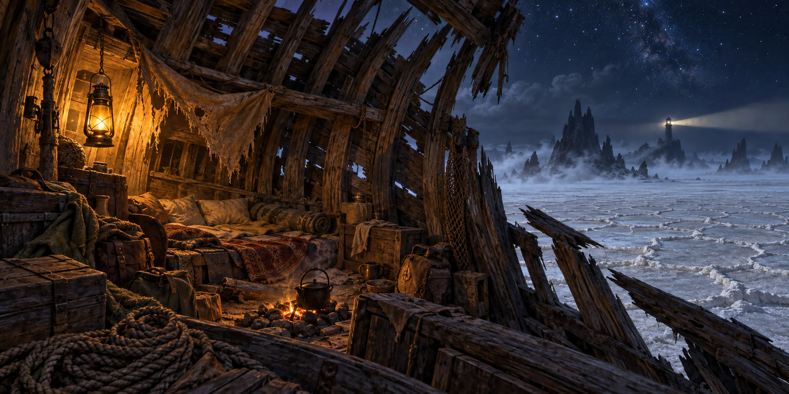
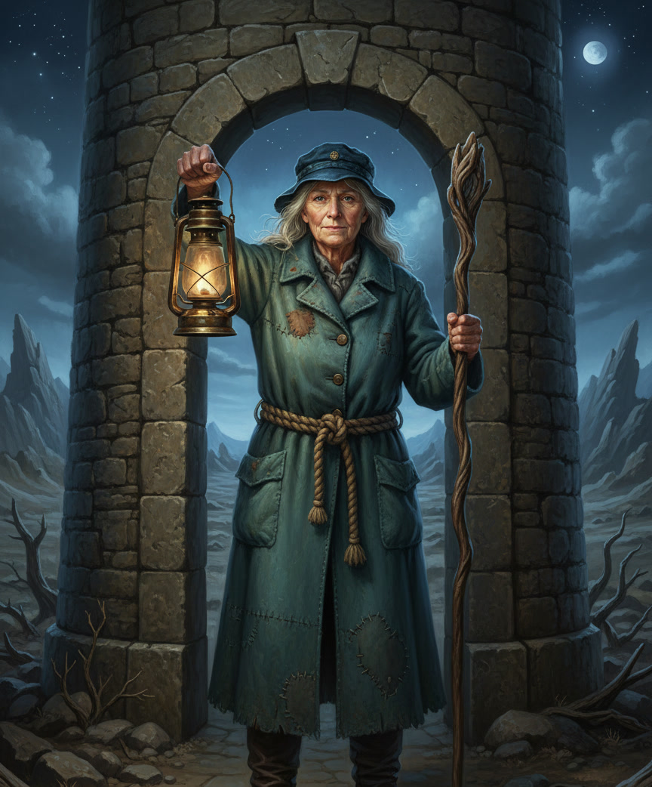
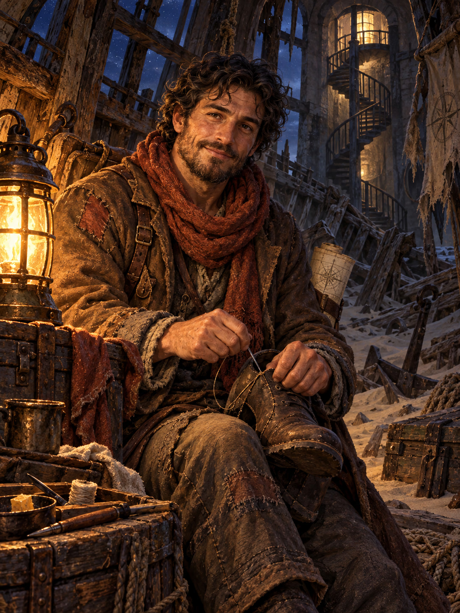
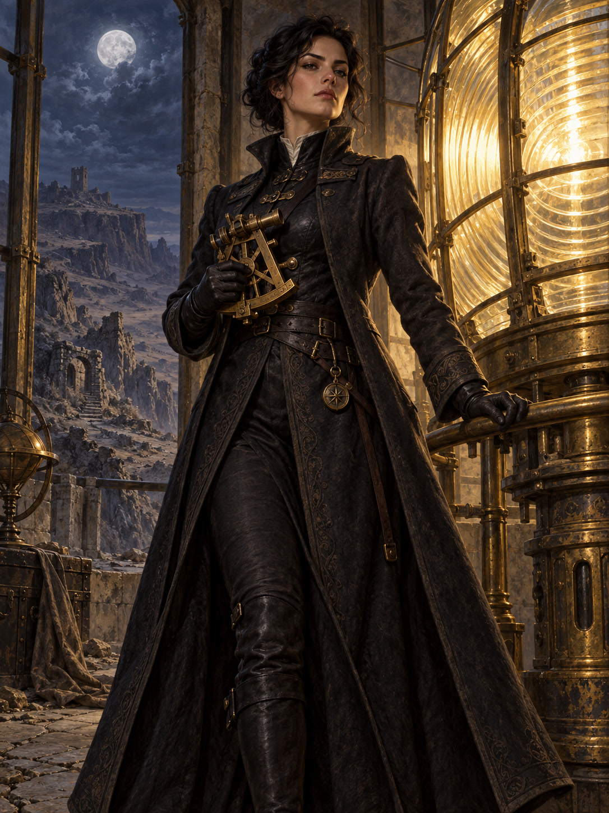
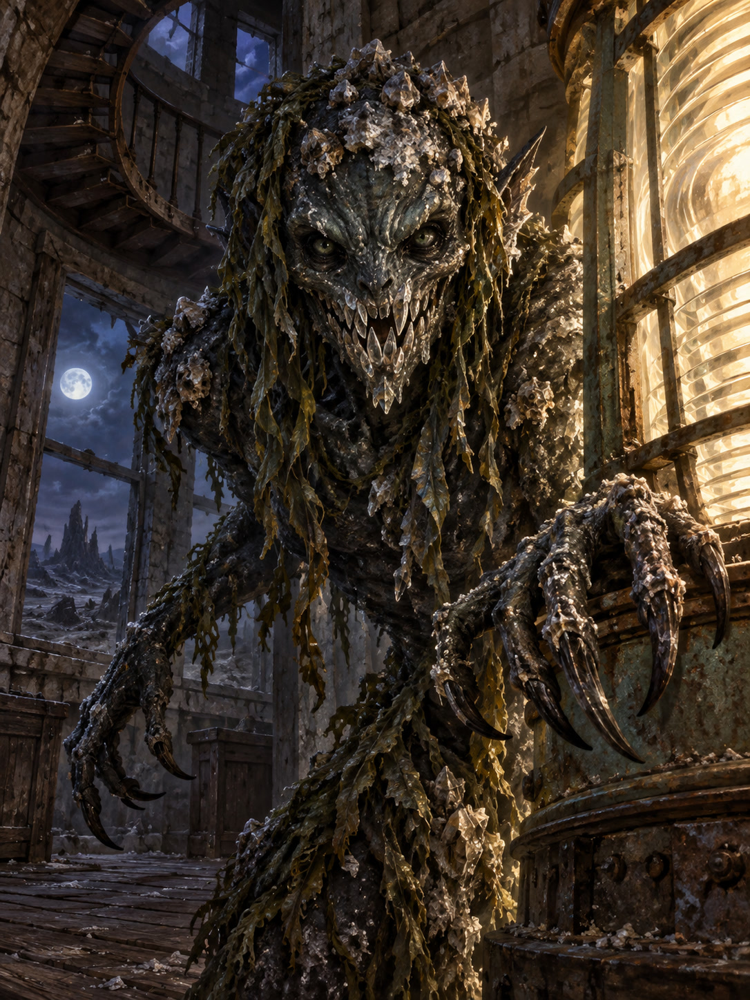

# Player Handouts — The Lighthouse on Dry Land

*Session 007 · The pictures below are the session's visual handouts. Show each one at the table as the party meets that thing — not all at once, and not before.*

> [!NOTE]
> **Art generated:** show each illustration only when the party reaches its corresponding scene. Nothing on these pages tells the players where they are, who is waiting, or what the light is for — that is theirs to work out at the table.
>
> **Portrait pages are image and name only.** Each NPC/creature portrait page holds one picture scaled to fill the sheet and the name in large bold type at the foot of the page, added by the PDF renderer. The artwork carries no lettering of its own, and no captions or description bullets appear on those pages — show the picture and read the cues from File 1 aloud.

---

# Where We Left Off

**Last session (006), confirmed:** at the Green Lord's table, **Sela Wyndmere** read the ribbons she had carried blind for twelve years, named what they were, and **ripped the binding ribbon herself.** **Oberon burst into butterflies.** Something took the whole party by the middle of the chest and **threw them out of the Bright Court Beneath.** Sela's fate is unknown.

**Tonight opens on the landing.** You come down hard on a **night road over flat, cracked ground** — no wood, no court, no Sela, and no way to tell where the seam put you. The air is dry, the sea is nowhere, and low on the horizon, turning, is **a lighthouse.** It has no water to warn. It is the only light in the whole flat dark.

---

## The Road and the Lighthouse

*(Show when the party takes in where they have landed.)*

- A shoreline road with no shore: cracked blue-grey flats both ways, salt crust like broken crockery, oyster beds for miles.
- A chipped old **mile-stone** leans at your feet; its carved numeral is worn to a stub, and the chip looks **fresh**.
- The **sea is gone**; the road is not. No surf, anywhere.
- A **bell-buoy tolls** somewhere out on ground you could walk to.
- The **lighthouse turns, low and yellow-white** — a light with nothing to warn. Its beam sweeps the flats, and from the road you can watch it come round.

---

## The Stranded Ship — the camp off the road

*(Show when the party finds the camp.)*

- A trader's hull lying on her beam ends out in the flat, high and dry and still standing — a little way off the road, roughly halfway between the road's edge and the light.
- **Masts as tent-poles**, tarpaulins strung between them, a **cook-fire** of scrap iron.
- A **row of salt-stained boots** nailed along the rail — one pair per traveller still living.
- Inside: people. Watchful, courteous, patient in a way that reads as waiting. They know the road loops. They know people have walked toward the light and not come back.

---

## Keeper Tamsin Reed

## Orin Vale

## Veyra Sorn

## The Brine Fiend

# Handout — Discovered

*(Show only when the party actually finds this out — a PC reading the broken mile-stone's flank, the road signs, or the ledger.)*

**The milestone and the road.** `SAR—EL` is still legible on the broken mile-stone. With it, an easy read (History or Survival DC 12) places the party: this is the coast road west of **New Sarshel**, in **Impiltur**, on ground that used to be underwater — and **New Sarshel is nine miles east**, well outside whatever has hold of this stretch of road.
